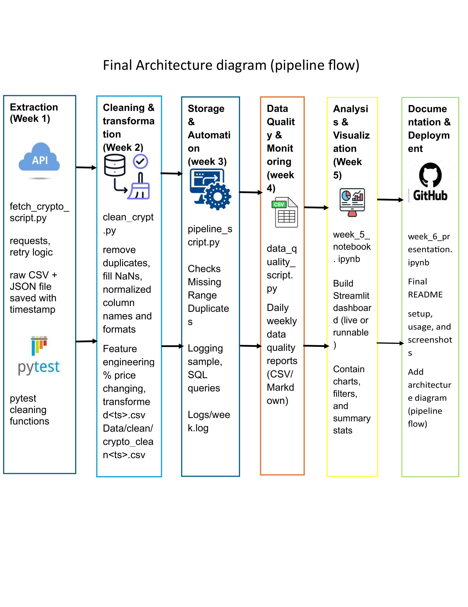

**Cryptocurrency ETL Pipeline**  
A Python-based data pipeline that fetches real-time cryptocurrency data from the CoinGecko API,  
saves raw snapshots (CSV + JSON), cleans and transforms the data, and stores it in SQLite.  
The project demonstrates automation, logging, SQL queries, and reproducible workflows for data analysis.  

**Author:** Sonia Mannepuli  
**Date:** September 2025  

## Week 1 – Setup & Extraction
- Chosen dataset: **Cryptocurrency (CoinGecko API)**  
- Fetched ~900 top coins
- Saved raw CSV file
- Saved raw **CSV + JSON snapshots** with timestamps  
- Implemented retry logic for failed requests  

## Week 2 – Data Cleaning & Transformation
- Normalized column names (lowercase, underscores)  
- Removed duplicates and handled missing values  
- Added feature engineering: `price_change_pct`  
- Saved cleaned dataset (`crypto_clean.csv`)  
- Unit tests (`pytest`) verify:  
  - No duplicate IDs  
  - No missing prices  

## Week 3 – Data Storage & Automation
- Stored cleaned data in:  
  - Master CSV (`crypto_master.csv`)  
  - SQLite database (`crypto_master.db`, table: `crypto`)  
- Verified using sample SQL queries in Jupyter:  
  ```sql
  SELECT COUNT(*) FROM crypto;
  SELECT id, name, current_price, market_cap FROM crypto ORDER BY market_cap DESC LIMIT 5;
  SELECT AVG(price_change_pct) FROM crypto;
  ```
- Automated with `schedule` (daily at midnight + immediate run)  
- Added logging for:  
  - Run timestamp  
  - Rows added  
  - Errors (if any)  
Example log:
2025-09-17 14:21:08,752 INFO SUCCESS: 0 new rows from crypto_clean.csv

## Data Storage
SQLite (`sqlite3`) was used successfully:  
- Cleaned data stored in table `crypto`  
- Each run updates the master dataset  
- Database can be queried in Python (`pandas.read_sql`) or external tools (e.g., DB Browser for SQLite)  
> PostgreSQL was optional in the rubric. SQLite was sufficient and fully implemented.

## Week 4 – Data Quality & Monitoring
- A data quality checker was implemented to detect missing values, duplicates, and invalid ranges.
- Daily CSV and Markdown reports are generated automatically to ensure data accuracy and consistency.

## Week 5 - Analysis & Visualization
- Performed EDA in Jupyter notebook
- Add time-series visualization  (trends line, moving average)
- Highlighted insights with visual storytelling through charts and summary statistics
- Built a Streamlit dashboard with interactive charts, filters, and summary stats

## Week 6 - Documentation and Deployment
Polished README with setup, usage instructions, and screenshots
Deployed the Streamlit dashboard to Streamlit Cloud
Verified live link: Explore the live dashboard

## Project Structure
- `data/raw/` → raw JSON + CSV snapshots  
- `data/clean/` → cleaned CSV, master CSV, SQLite DB  
- `scripts/` → Python scripts (`fetch_crypto.py`, `clean_crypto.py`, `automate_pipeline', 'data_quality_scripts')

## Packages Installed
pip install pandas requests sqlite schedule logging streamlit

## Running the Pipeline
- python scripts/fetch_crypto.py   # Fetch raw + clean data
- python scripts/clean_crypto.py   # Transform data
- python scripts/automate_pipeline.py  # Daily scheduled run with logging

## Run dashboard locally
- streamlit run app.py

## Live Demo
[Explore the live dashboard](https://cryptocurrency-project-eyuyea4dziforvj2mrizkh.streamlit.app/)

## Pipeline Architecture Diagram
This diagram illustrates the full end-to-end flow of the cryptocurrency ETL pipeline, from data extraction to deployment.

